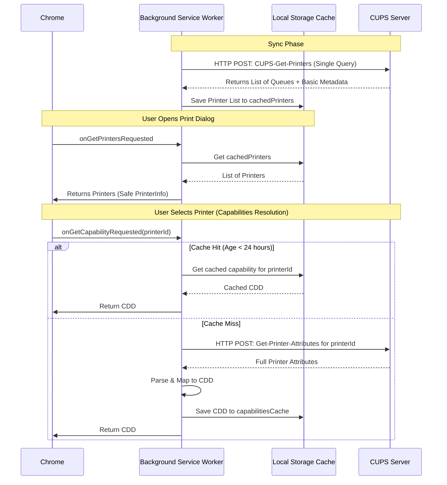

# Cupsie Chrome Extension Architecture

This document provides a detailed technical overview of the architecture of **Cupsie Printer Provider**, a Chrome Extension built using the Manifest V3 and the `chrome.printerProvider` API to integrate CUPS print queues and standalone IPP/IPPS printers directly into Chrome's native print dialog.

---

## 1. Network Host Permissions

Chrome extensions require host permissions to interact with servers via network requests (e.g., `fetch`). To maintain user trust and satisfy security requirements, host permissions for printer endpoints are optional.

### Dynamic User Requests
When a user manually adds CUPS servers or standalone IPP printers in the Options page:
1. The configuration is validated in `options.js`.
2. The extension parses the hostnames of the servers and printers to generate match patterns in the format `*://${hostname}/*`. 
3. The options page pops-up an access permission message to request accessing all the added printers and/or CUPS servers.
4. If permissions are granted, settings are persisted to `chrome.storage.sync` to allow the synchronization if the user multiple computers.

### Enterprise Policy Bypass
For enterprise deployments, prompt-free installation is critical. IT administrators can bypass the dynamic host permissions prompts using Chrome's extension management policy (`ExtensionSettings`):
1. The extension is deployed in `force_installed` installation mode.
2. The administrator defines `runtime_allowed_hosts` in the policy (e.g. `["<all_urls>"]` or specific internal IP range patterns).
3. Chrome automatically grants these host permissions upon installation, allowing the background sync and printing operations to proceed seamlessly without prompting the user.

### Synced Settings & Missing Device Permissions
When a user has Chrome Sync enabled and sets up the extension on a new device (e.g., Computer2):
1. Chrome Sync automatically restores their printer URLs and sync settings from `chrome.storage.sync`.
2. Chrome does **not** synchronize previously granted optional host permissions across devices due to security boundaries.
3. Upon opening the Options page on the new device, the extension aggregates the origins of all synced (and managed) CUPS servers and standalone printers and checks their availability.
4. If the check fails, a persistent warning banner is displayed prompting the user: *"Connection permissions for some synced printers are missing on this device. Please click 'Save Settings' to grant access."*
5. When the user clicks **Save Settings**, a local permission prompt is displayed. Once approved, the warning banner is dismissed and the background sync worker is unblocked on the new device.

---

## 2. Username Retrieval from Synced Account

To support user-level access controls, the extension identifies the currently logged-in Chrome user.
2. If the user is synced and the API returns an email address (e.g., `bob@example.com`), the extension extracts the username portion before the `@` symbol:
   ```javascript
   return userInfo.email.split('@')[0]; // returns "bob"
   ```
3. If the profile email is unavailable (e.g., sync disabled), it falls back to `null` or a generic username like `"Chrome User"`.

---

## 3. Access Verification & CUPS Allowlists

CUPS servers specify who is authorized to print to specific queues using user control lists. The extension enforces this at the client level across three distinct phases.

### Fetching User Lists
During IPP operations (e.g., `CUPS-Get-Printers` or `Get-Printer-Attributes`), the printer or CUPS server returns these lists as part of the queue attributes:
* `requesting-user-name-allowed` (Allowlist)
* `requesting-user-name-denied` (Denylist)

### Three-Phase Enforcement
The extension applies the helper `isUserAllowed(username, allowedList, deniedList)`:

1. **Discovery & Sync Phase**:
   During synchronization, if `isUserAllowed` evaluates to `false` for the retrieved username, the extension skips caching this queue entirely. The user will not see the printer in their print destination picker.
2. **Capability Query Phase**:
   When the user opens the Chrome print dialog and selects a printer, `onGetCapabilityRequested` is fired. The extension fetches (or reads from cache) the allow/deny lists. If the user is blocked, it blocks the capability payload, logs a warning, displays an access-denied notification, and returns an empty description.
3. **Print Submission Phase**:
   When the user submits a job, `onPrintRequested` is fired. As a final guard, the extension checks the cached lists. If the user is denied, it immediately rejects the job with `FAILED` without sending bytes over the network.

---

## 4. Optimized Sync Pattern (One-Query Sync)

To keep network overhead low and prevent performance degradation, the extension minimizes traffic when communicating with printers.



### CUPS Server Discovered Queues
Instead of querying every printer queue individually during synchronization, the extension sends a single **`CUPS-Get-Printers`** IPP request to the CUPS server. This request fetches all exposed printer queues and their basic metadata in a single network round-trip.

### Deferred Capabilities Fetching
The full printer capabilities (resolutions, media sizes, input/output trays) are not requested during synchronization. Instead:
1. Discovered printers are saved with basic details (ID, name, description) in `chrome.storage.local`.
2. Detailed capabilities are queried only on-demand when the user selects a printer in the print dialog (`onGetCapabilityRequested`).

### Capabilities Cache
To avoid repeated capabilities queries, retrieved capabilities are cached in `capabilitiesCache` with a 24-hour expiration time. A network request is only performed on a cache miss or when the cache expires.

---

## 5. IPP Response Parsing & CDD Translation

The extension handles the low-level encoding and mapping of IPP attributes itself, without external dependencies.

### Binary IPP Parsing
The `parseIppResponse(arrayBuffer)` function in `ipp.js` decodes standard IPP binary formats.
1. It reads the 8-byte IPP header: `version` (2 bytes), `statusCode` (2 bytes), and `requestId` (4 bytes).
2. It iterates through the remaining stream to process attributes grouped by delimiter tags (e.g. `0x04` for printer attributes).
3. It parses each attribute by reading its tag, name length, name, value length, and value bytes.
4. Values are parsed according to their tags:
   * **Text/URI/Keywords/MIME Types** (`0x41`–`0x49`): Decoded via `TextDecoder` as UTF-8 strings.
   * **Integers/Enums** (`0x21`, `0x23`): Parsed as 32-bit big-endian integers.
   * **Booleans** (`0x22`): Parsed as `valBytes[0] === 1`.
   * **Resolutions** (`0x32`): Decoded into `X_DPIxY_DPI` strings.
   * **Ranges of Integers** (`0x33`): Decoded as `[min, max]` arrays.

### Cloud Device Description (CDD) Translation
The `buildCDD(ippAttributes)` function in `cdd.js` transforms raw IPP attributes into the CDD structure required by Chrome:
* **Color Mode**: Maps `print-color-mode-supported` to `STANDARD_COLOR` and `STANDARD_MONOCHROME`.
* **Duplex**: Maps `sides-supported` to `NO_DUPLEX`, `LONG_EDGE`, or `SHORT_EDGE`.
* **Paper Sizes**: Extracts size identifiers from `media-supported`. Standard sizes are mapped to CDD names (e.g., `NA_LETTER`, `ISO_A4`). Non-standard sizes are parsed to extract micron dimensions.
* **Tray & Media Capabilities**: Translates attributes like `media-source-supported` (Input Trays), `output-bin-supported` (Output Bins), and `media-type-supported` (Paper Types) into standard `SELECT` vendor capabilities.
* **Finishing Options**: Decodes finishing enums (like staple top-left, punch, bind) using a standard lookup map and represents them as select options.
* **Defaults**: Uses IPP `default` attributes (e.g. `media-default`) to set the `is_default` property on corresponding options.

---

## 6. Option Default Handling ("Use Printer Default")

To avoid forcing users to configure every option in Chrome's print dialog, the extension dynamically resolves defaults:
* **Explicit Server Default**: If the printer has a default option set (e.g. `media-source-default`), that option is selected in the print dialog.
* **Fallback to Printer Default**: If the printer does not expose a default option, the dropdown defaults to **"Use Printer Default"** (internal value `__printer_default__`).
* **Omitting Unused Attributes**: When submitting the print job, any option set to `"Use Printer Default"` is omitted from the IPP request. This allows the CUPS server/printer to use its own server-side default configuration.
